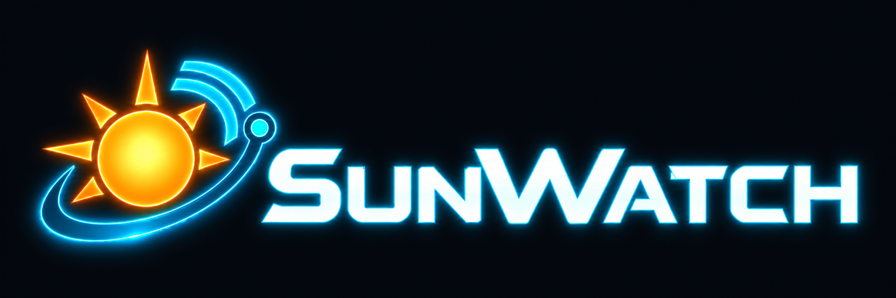

# SunWatch — Suncoast live location portal



SunWatch puts Suncoast locations into the original God's Eye Cesium globe: its tactical HUD, camera navigation, aircraft, traffic and environmental layers, with a searchable branch/ATM panel. This rebuild replaces the earlier Leaflet prototype.

## Explore

- Search 81 branches and 88 additional ATM directory records across 20 Florida counties. Select a mapped location to fly there while keeping your active layers.
- Switch between street-scale, surroundings and airspace views. Nearby filters branches/ATMs within 5–50 km of the selected location or viewed area.
- Toggle aircraft, TomTom traffic flow, rain radar, hurricanes, wind, public cameras and NASA heat detections; additional original layers remain in DATA LAYERS.
- View location-specific NWS alerts and forecasts. Add your own addresses, review geocoding matches, import coordinates and export locations.
- Keep manual operating status and notes locally in your browser. Unknown means unverified, never automatically open or closed.

Satellite imagery is the default inside the 3D globe. The original map selector also offers street labels and photorealistic 3D via Cesium ion. No voice, paid AI service or direct Google API key is enabled. Detailed aircraft models are bounded to the nearby area to control rendering load.

## Run locally

Node 24+ is required. From the repository root:

```sh
npm ci --ignore-scripts
cd sunwatch
npm ci
cp .env.deploy .env
npm run build
npm start
```

Open http://localhost:4180. `HOST=0.0.0.0` permits LAN connections if the host firewall allows them. Runtime `.env` is ignored. At the owner's explicit request, `.env.deploy` contains TomTom, NASA FIRMS and Cesium data keys. The Cesium browser token is delivered at runtime, rather than compiled into the bundle.

From the root, test the deployment image with:

```sh
docker compose -p sunwatch-local -f compose.sunwatch.local.yml up --build -d
# http://127.0.0.1:4181
```

See [deployment memo](DEPLOY.sunwatch.md) and [validation](sunwatch/VALIDATION.md). The earlier Leaflet build is deployed on Aech; this globe rebuild still needs a pull and rebuild from the deployment machine.

## Data and coverage

Florida cameras: CAMERAS now loads the public FL511 statewide camera catalog and refreshing JPEG snapshots, without another key. SunWatch defaults to `CCTV_REGION=florida` and a 5,000-record ceiling; set `CCTV_REGION=global` to include the other upstream regions. The catalog currently has 4,960 records. Camera headings/mounting poses are uncalibrated, and individual feeds can be offline. These are snapshots, not continuous video or private Flock feeds.

Official directory: https://locations.suncoastcreditunion.com, collected September 27, 2026. Branch coordinates come from official records. Of 88 ATM records, 75 have address-estimated coordinates and 13 require address review before mapping. Directory records may include ATMs colocated with branches. Published schedules do not confirm storm opening status.

Traffic dots visualize measured TomTom road flow; they are not tracked individual vehicles. Flight coverage depends on public receivers and can use a labeled fallback feed or stale cache. Public ALPR markers describe camera locations, not access to camera feeds; public CCTV coverage varies and is not comprehensive in Florida. Weather comes from NWS, NOAA and NHC; NASA heat detections are neither confirmed fire incidents nor fire perimeters. Provider attribution remains visible in the globe. The optional noncommercial submarine-cable dataset is excluded.

Imports and notes live in each browser's local storage, not a shared operations database. Exported notes are included in JSON, but import currently restores locations only. Address lookup sends addresses to TomTom; map/feed requests disclose the viewed area to their providers. Server geocoding limits are 20/minute and 500/day per process. Traffic tile budgets and caches use a persistent Docker volume. Provider quotas and coverage still apply.

This independent prototype is intended for the Innovation Club demonstration, not an official Suncoast emergency-management system. Power, staffing, connectivity and confirmed branch closures require operational inputs not supplied here.

## Credits

Forked from [Bilawal Sidhu's God's Eye View](https://github.com/bilawalsidhu/gods-eye-view), under its existing MIT [LICENSE](LICENSE). SunWatch runs the original globe frontend with a location portal and provider backend. Service data retains its providers' terms. See [logo notes](sunwatch/LOGO.md).

